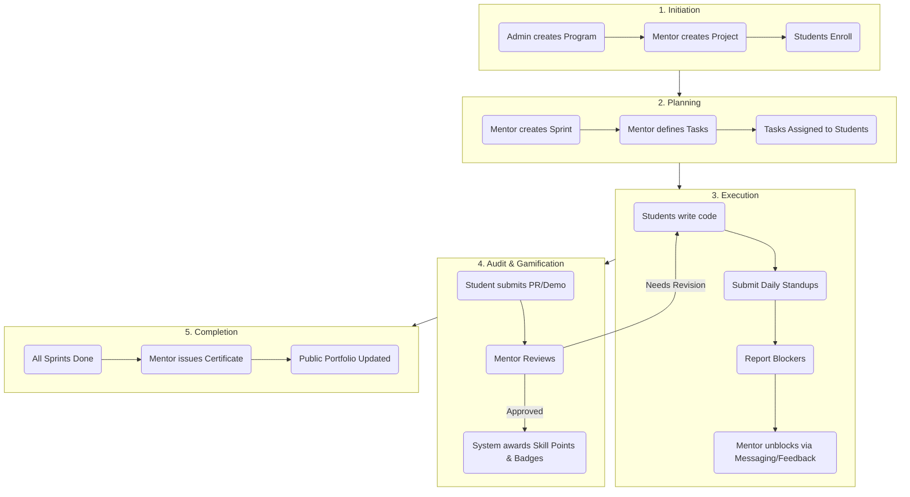

# CoderCorps Role Profiles & Project Lifecycle Architecture

This document outlines the permissions, feature access, and system architecture for the CoderCorps ecosystem. It covers how each role interacts with specific features, alongside the High-Level Design (HLD) and Low-Level Design (LLD) of the project lifecycle.

---

## 1. User Roles & Feature Access

### 🛡️ Admin (Platform Administrator)
The Admin manages the ecosystem's infrastructure and global configurations.
- **Role Management Feature**: Admins access the global Dashboard to promote/demote users (`Student` ↔ `Mentor` ↔ `Admin`). This dictates what UI components render for those users globally.
- **Global Audit Feature**: Admins can view the system-wide Global Activity Log to monitor all API mutations (commits, reviews, certificate issuances) across all projects without being explicit members.
- **Program Creation**: Admins initialize `Programs` (e.g., cohorts or semesters) which act as the parent container for all mentor-led projects.

### 🎓 Mentor (Project Lead / Staff Engineer)
Mentors act as technical leads. They use platform features to guide development and audit code.
- **Kanban Board Feature**: Mentors use the drag-and-drop Sprint board to define `Tasks`. They write descriptions, assign point values, and allocate tasks to specific students to organize the workflow.
- **Pending Submissions Board**: When a student completes a task, it appears on the Mentor's dashboard. Mentors use this feature to review the GitHub Repo/Demo URL, provide written feedback, and click "Approve" or "Request Revision".
- **Stuck Students Widget**: An automated dashboard widget flags students who haven't submitted daily reports or have marked tasks with blockers. Mentors use this to proactively message students.
- **Certification Feature**: Upon project completion, Mentors use the audit interface to generate a Verifiable Certificate, anchoring the student's success in the database.

### 🚀 Student (Contributor / Developer)
Students are the builders. They use platform features to write code, report progress, and build a portfolio.
- **Active Tasks Feature**: Students view their assigned tasks on their dashboard. They use this feature to track their current sprint responsibilities and update task statuses (`in_progress` → `done`).
- **Daily Standup Feature**: A daily form where students log their `Todos`, `Blockers`, and `Hours Spent`. Using this feature consecutively triggers automated gamification hooks (e.g., the 7-Day Streak badge).
- **Public Portfolio Feature**: A dynamically generated profile page featuring a 3D Skill Galaxy. As students use the platform and get tasks approved, this feature automatically updates with new SVG Badges, unlocked skills, and verifiable certificates to share with recruiters.

---

## 2. Project Lifecycle: High-Level Design (HLD)

The HLD represents the conceptual flow of a project through the CoderCorps system, from the perspective of user interaction and state changes.

---

## 3. Project Lifecycle: Low-Level Design (LLD)

The LLD breaks down the exact technical processes, database models, and API interactions that occur during the lifecycle phases.

### Phase 1: Initiation
- **Action**: Program & Project Creation.
- **API Flow**: 
  - Admin `POST /api/v1/programs` ➔ Inserts into `programs` table.
  - Mentor `POST /api/v1/projects` ➔ Inserts into `projects` table (links to `program_id`).
- **DB Models**: `Program`, `Project`, `ProjectMember`.
- **Logic**: When a student joins, a `ProjectMember` row is created with `role="contributor"`, establishing the many-to-many relationship.

### Phase 2: Planning
- **Action**: Sprint & Task definition.
- **API Flow**: 
  - Mentor `POST /api/v1/sprints` ➔ Inserts into `sprints` table.
  - Mentor `POST /api/v1/tasks` ➔ Inserts into `tasks` table.
- **DB Models**: `Sprint`, `Task`, `TaskAssignment`.
- **Logic**: Tasks are assigned an `estimated_hours` and a `skill_points` reward. A `TaskAssignment` row maps the `Task` to the `User` (Student).

### Phase 3: Execution
- **Action**: Daily Standups & Work.
- **API Flow**: 
  - Student `POST /api/v1/daily/reports` ➔ Inserts into `daily_reports` table.
  - Student `PATCH /api/v1/daily/todos/{id}` ➔ Updates `daily_todos` table status.
- **DB Models**: `DailyReport`, `DailyTodo`, `Notification`.
- **Logic**: The API calculates consecutive dates. If a threshold is met (e.g., 7 days), it triggers the `badge_evaluator.evaluate_streak()` hook, inserting a `UserBadge` row for the student. Notifications are fired to the Mentor indicating a report was submitted.

### Phase 4: Audit & Review
- **Action**: Code submission and mentor approval.
- **API Flow**: 
  - Student `POST /api/v1/tasks/{id}/submissions` ➔ Inserts into `task_submissions` table (status: `submitted`).
  - Mentor `PATCH /api/v1/tasks/submissions/{id}/review` ➔ Updates status to `approved` or `needs_revision`.
- **DB Models**: `TaskSubmission`, `UserBadge`, `User` (Skill Points).
- **Logic**: 
  1. Mentor sends `PATCH` with feedback and a `mentor_score`.
  2. If approved, the system updates the `TaskAssignment` status to `reviewed`.
  3. The system fires `evaluate_blocker_crusher()` and `evaluate_system_architect()`.
  4. The system aggregates the `skill_points` from the Task and increments `User.skill_points`.

### Phase 5: Completion
- **Action**: Final validation and portfolio minting.
- **API Flow**: 
  - Mentor `POST /api/v1/submissions/certificates` ➔ Inserts into `certificates` table.
  - Visitor `GET /api/v1/portfolio/{username}` ➔ Fetches aggregated public data.
- **DB Models**: `Certificate`, `Profile`.
- **Logic**: The certificate stores cryptographic or immutable criteria (e.g., `audit_message`, `project_title`, `mentor_name`) in a JSON blob. The frontend fetches `User.badges`, `User.certificates`, and `User.skill_points` to render the 3D Skill Galaxy and Trophy Case securely on the public route.
