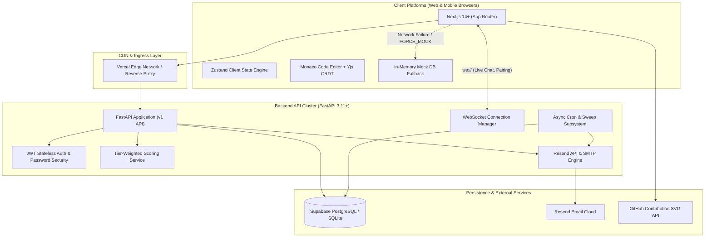

# 🚀 CoderCorps Platform: End-to-End System Documentation & Architecture Guide

> **Document Version:** 1.0.0  
> **Status:** Production / Audited  
> **Scope:** Full-Stack Architecture, Database Schemas, API Endpoints, Gamification Engine, Screening Automation, and Operational Guides.

---

## 📑 Table of Contents
1. [Executive Summary & Platform Mission](#1-executive-summary--platform-mission)
2. [End-to-End System Architecture](#2-end-to-end-system-architecture)
3. [Technology Stack](#3-technology-stack)
4. [User Roles & Permission Matrix](#4-user-roles--permission-matrix)
5. [Frontend Architecture & Route Directory](#5-frontend-architecture--route-directory)
6. [Backend Architecture & API Catalog](#6-backend-architecture--api-catalog)
7. [Database Schema & Entity Relationships](#7-database-schema--entity-relationships)
8. [Core Feature Modules & Workflows](#8-core-feature-modules--workflows)
   - [8.1 Sprint & Kanban Task Flow](#81-sprint--kanban-task-flow)
   - [8.2 Daily Standups & Accountability Automation](#82-daily-standups--accountability-automation)
   - [8.3 Real-Time Collaboration & Pair Programming](#83-real-time-collaboration--pair-programming)
   - [8.4 Gamified Progression: The "Skill Galaxy"](#84-gamified-progression-the-skill-galaxy)
   - [8.5 Candidate Screening & Tier-Weighted Scoring Engine](#85-candidate-screening--tier-weighted-scoring-engine)
   - [8.6 Verifiable Credential & Certificate Minting](#86-verifiable-credential--certificate-minting)
9. [Automated Scheduled Tasks & Cron Sweeps](#9-automated-scheduled-tasks--cron-sweeps)
10. [Security Hardening & Zero-Trust Policies](#10-security-hardening--zero-trust-policies)
11. [Testing, QA & Verification Log](#11-testing-qa--verification-log)
12. [Environment Configuration & Deployment Setup](#12-environment-configuration--deployment-setup)

---

## 1. Executive Summary & Platform Mission

**CoderCorps (CCweb)** is a modern engineering accelerator platform that bridges the gap between academic education and industry software engineering. Instead of theoretical exercises, students work on production-grade software in simulated 2-week sprint cycles under the guidance of industry mentors and staff engineers.

### Core Value Propositions
- **Proof-of-Work Portfolios**: Replaces static, self-reported resumes with verified code contributions (merged GitHub PRs, live demo links, mentor scores, and AI code audits).
- **Gamified Competency ("Skill Galaxy")**: Visualizes technical skills as an interactive 3D constellation map where nodes illuminate only after verified deliverables.
- **Candidate Gatekeeper**: Employs an automated, randomized, and timed technical screening assessment with tier-weighted scoring to evaluate applicants objectively.
- **Real-Time Collaboration**: Features multi-tenant project rooms, integrated direct messaging, and live collaborative Monaco code editors powered by Yjs CRDTs.

---

## 2. End-to-End System Architecture

CoderCorps implements a modern decoupled client-server architecture:



### Communication Channels
1. **HTTP/REST (v1 API)**: Handles user authentication, project creation, task state updates, standup submissions, portfolio loading, and assessment flows.
2. **WebSockets (Live Collaboration)**:
   - **Project Rooms (`/ws/rooms/{project_id}`)**: Real-time multi-user team chat with member join/leave broadcasts.
   - **Pair Programming (`/ws/pair/{project_id}`)**: Collaborative code editor synchronizing keystrokes via Yjs CRDTs.
3. **Background Cron Sweeps**: Standalone scheduled Python worker processes executing expiry checks, email reminder notifications, and daily standup accountability sweeps.

---

## 3. Technology Stack

### Frontend Stack
| Layer | Technologies | Purpose |
| :--- | :--- | :--- |
| **Framework** | Next.js 14+ (App Router), React 18/19 | Server and client component rendering |
| **Language** | TypeScript | Strict compile-time static type safety |
| **Styling** | Tailwind CSS, Shadcn UI | Utility-first responsive design and accessible components |
| **Animation** | Framer Motion, GSAP | Smooth transitions, flip cards, and constellation effects |
| **3D / Canvas** | Three.js, Lucide Icons | 3D graphics and UI iconography |
| **State Management** | Zustand | Multi-store client state caching with optimistic UI updates |
| **Editor / CRDT** | Monaco Editor, Yjs | In-browser real-time collaborative coding |
| **Build Engine** | Turbopack / Webpack | Fast refresh and bundle optimization |

### Backend Stack
| Layer | Technologies | Purpose |
| :--- | :--- | :--- |
| **Framework** | FastAPI (Python 3.11+) | High-throughput asynchronous REST API & WebSockets |
| **ORM** | SQLAlchemy 2.0 | Declarative database modeling and query generation |
| **Database** | PostgreSQL (Supabase) / SQLite | Relational persistence across dev and prod environments |
| **Migrations** | Alembic | Version-controlled database schema migrations |
| **Validation** | Pydantic v2 | Strict request/response parsing and data validation |
| **Security** | Passlib (Bcrypt), PyJWT | Password hashing and stateless access/refresh tokens |
| **Email Service** | Resend API, Python `smtplib` | Automated email delivery with mock logger fallback |
| **Testing** | Pytest, HTTPX | Automated test suite verifying business logic and security |

---

## 4. User Roles & Permission Matrix

| Capability / Resource | 🛡️ Admin | 👨‍🏫 Mentor | 🚀 Student | 🌐 Public Visitor |
| :--- | :---: | :---: | :---: | :---: |
| **View Landing Page & Academy Tracks** | ✅ | ✅ | ✅ | ✅ |
| **Apply for Internship Screening** | — | — | — | ✅ |
| **Take 1-Time Timed Assessment** | — | — | — | ✅ (Token Holder) |
| **Verify Public Certificates (`/certify/[id]`)** | ✅ | ✅ | ✅ | ✅ |
| **View Public Portfolio Profiles** | ✅ | ✅ | ✅ | ✅ |
| **Create Cohort Programs** | ✅ | ❌ | ❌ | ❌ |
| **Promote / Demote User Roles** | ✅ | ❌ | ❌ | ❌ |
| **Platform-Wide Audit & User Directory** | ✅ | ❌ | ❌ | ❌ |
| **Create Projects & Sprints** | ✅ | ✅ | ❌ | ❌ |
| **Create & Assign Tasks (Single/Multi-Assign)** | ✅ | ✅ | ❌ | ❌ |
| **Audit Submissions & Assign Scores (0-100)** | ✅ | ✅ | ❌ | ❌ |
| **Issue / Mint Verifiable Certificates** | ✅ | ✅ | ❌ | ❌ |
| **Review Candidate Screening Attempts** | ✅ | ✅ | ❌ | ❌ |
| **Submit Daily Standup Reports & Checklists** | ❌ | ❌ | ✅ | ❌ |
| **Update Assigned Task Status (`in_progress` -> `done`)** | ❌ | ❌ | ✅ | ❌ |
| **Raise Stuck Flags & Request Peer Reviews** | ❌ | ❌ | ✅ | ❌ |
| **Submit Task PRs and Project Final Repos** | ❌ | ❌ | ✅ | ❌ |

---

## 5. Frontend Architecture & Route Directory

The frontend is organized using Next.js App Router route groups:

```text
frontend/src/
├── app/
│   ├── (auth)/                               # Authentication routes
│   │   ├── login/page.tsx                    # User login form
│   │   ├── signup/page.tsx                   # User registration
│   │   └── forgot-password/page.tsx          # Password recovery
│   ├── (marketing)/                          # Public informational pages
│   │   ├── layout.tsx                        # Public navbar & footer
│   │   ├── page.tsx                          # Hero landing page + Activity feed
│   │   ├── academy/page.tsx                  # Learning tracks & curriculum
│   │   ├── mentors/page.tsx                  # Mentor directory with flip cards
│   │   ├── apply/page.tsx                    # Candidate application intake form
│   │   ├── assessment/candidate/[token]/     # 1-time timed screening test UI
│   │   ├── about/page.tsx                    # About CoderCorps mission
│   │   └── contact/page.tsx                  # Contact form
│   ├── (platform)/                           # Authenticated dashboard workspace
│   │   ├── layout.tsx                        # Platform sidebar, Command palette (⌘K)
│   │   ├── dashboard/page.tsx                # Role-aware user dashboard
│   │   ├── today/page.tsx                    # Student Daily Standup & todo tracker
│   │   ├── projects/                         # Project spaces & Kanban boards
│   │   │   ├── page.tsx                      # All active projects directory
│   │   │   ├── [id]/page.tsx                 # Project workspace, sprints & Kanban
│   │   │   ├── [id]/pair/page.tsx            # Collaborative Monaco pair coding
│   │   │   └── [id]/leaderboard/page.tsx     # Project leaderboard & review deck
│   │   ├── mentor/                           # Mentor-exclusive tool suite
│   │   │   ├── dashboard/page.tsx            # Mentor overview
│   │   │   ├── students/page.tsx             # Student progress roster
│   │   │   ├── reports/page.tsx              # Standup reports & feedback tool
│   │   │   ├── reviews/page.tsx              # Pending submissions review deck
│   │   │   └── assessments/page.tsx          # Candidate assessment audit table
│   │   ├── admin/                            # Platform admin tools
│   │   │   └── page.tsx                      # Global users, roles, and cohorts
│   │   ├── recruiters/page.tsx               # Recruiter Skill Galaxy candidate search
│   │   ├── rooms/page.tsx                    # Real-time WebSocket discussion rooms
│   │   ├── messages/page.tsx                 # One-on-one direct message threads
│   │   └── settings/page.tsx                 # User profile & mentor office hours
│   ├── certify/[id]/page.tsx                 # Public verifiable certificate view
│   └── portfolio/[username]/page.tsx         # Public student portfolio & Skill Galaxy
├── components/                               # Reusable UI component library
│   ├── ui/                                   # Shadcn core components (Button, Dialog, etc.)
│   ├── Navbar.tsx                            # Top navigation header
│   ├── CommandPalette.tsx                    # Keyboard shortcut menu (⌘K / Ctrl+K)
│   ├── SkillGalaxy.tsx                       # Interactive constellation skill graph
│   └── ThemeToggle.tsx                       # Animated dark/light mode toggle
├── lib/
│   ├── api.ts                                # Resilient API fetch client with silent refresh
│   ├── auth.tsx                              # React authentication context provider
│   └── mockDb.ts                             # Client-side in-memory mock DB fallback
└── stores/                                   # Zustand global state stores
    ├── useProjectWorkspaceStore.ts           # Caches project sprints & tasks (30s TTL)
    ├── useDashboardStore.ts                  # Caches dashboard statistics
    └── useNotificationStore.ts               # Real-time in-app notification alerts
```

---

## 6. Backend Architecture & API Catalog

The backend is built with FastAPI, exposing 29 specialized modular routers under `/api/v1/`:

```text
backend/app/
├── api/v1/
│   ├── auth.py                  # POST /auth/login, /signup, /refresh, /me
│   ├── public_apply.py          # POST /apply, /assessment/candidate/{token}/start, /answer, /result
│   ├── admin_candidates.py      # GET /admin/candidate-assessments (Mentor/Admin audit)
│   ├── admin.py                 # GET/PATCH /admin/users, /admin/stats
│   ├── programs.py              # GET/POST /programs (Cohort management)
│   ├── projects.py              # GET/POST /projects, /projects/{id}/members, /join
│   ├── tasks.py                 # GET/POST/PATCH /tasks, /assign, /stuck
│   ├── daily.py                 # GET/POST /daily/reports, /daily/todos, /feedback
│   ├── submissions.py           # POST /submissions, PATCH /submissions/{id}/review
│   ├── certificates.py          # GET /certificates/{id}, /user/{id}
│   ├── portfolio.py             # GET /portfolio/{username}, PATCH /portfolio/me
│   ├── dashboard.py             # GET /dashboard/summary (Role-aware stats)
│   ├── assessments.py           # Internal assessment endpoints and attempts
│   ├── quizzes.py               # Gatekeeper quizzes and attempts
│   ├── badges.py                # GET /badges, /user/{id}/badges
│   ├── recruiters.py            # GET /recruiters/candidates (Filter by skills)
│   ├── rooms.py                 # WebSocket /ws/rooms/{project_id} & room history
│   ├── messages.py              # GET/POST /messages/thread/{user_id}
│   ├── notifications.py         # GET/PATCH /notifications, /read-all
│   ├── stuck_flags.py           # GET/PATCH /stuck-flags/{id}/resolve
│   ├── peer_reviews.py          # POST/PATCH /peer-review/request, /review
│   ├── announcements.py         # POST /announcements, GET /announcements/unread
│   ├── task_comments.py         # GET/POST /task-comments
│   ├── activity.py              # GET /activity/recent (Public activity stream)
│   ├── contact.py               # POST /contact (Public inquiries)
│   ├── mentors.py               # GET /mentors/directory, /mentors/availability
│   └── webhooks.py              # External CI/CD and form ingestion webhooks
├── core/
│   ├── config.py                # Pydantic BaseSettings loading .env
│   └── security.py              # Bcrypt hashing and JWT token creation/decoding
├── db/
│   ├── base.py                  # DeclarativeBase registering all models
│   └── session.py               # SQLAlchemy Engine & SessionLocal provider
├── models/                      # SQLAlchemy ORM class definitions (14 model files)
├── schemas/                     # Pydantic validation models for requests/responses
├── services/
│   ├── scoring.py               # Tier-weighted assessment scoring algorithm
│   └── email_service.py         # Resend API and SMTP dispatcher
└── cron/                        # Automated background workers
    ├── assessment_reminders.py  # Candidate sweep (+6h, +12h, +18h, 24h expiry)
    ├── accountability.py        # Daily standup rollover & missing check-in alerts
    └── digest.py                # Daily and weekly mentor digest notifications
```

---

## 7. Database Schema & Entity Relationships

```mermaid
erDiagram
    USER {
        int id PK
        string name
        string email UK
        string password_hash
        string role "student | mentor | admin"
        string status "active | pending | inactive"
        int skill_points "cached aggregate"
    }

    PROFILE {
        int id PK
        int user_id FK
        string bio
        string college
        string github_url
        string linkedin_url
        boolean is_public
        string mentor_availability
    }

    PROJECT {
        int id PK
        int program_id FK
        string title
        string description
        string status "active | completed | archived"
        int mentor_id FK
    }

    PROJECT_MEMBER {
        int id PK
        int project_id FK
        int user_id FK
        string role "lead | contributor"
    }

    SPRINT {
        int id PK
        int project_id FK
        int sprint_number
        datetime start_date
        datetime end_date
        string goal
    }

    TASK {
        int id PK
        int sprint_id FK
        string title
        string description
        string status "todo | in_progress | review | done"
        int estimated_hours
        int skill_points
        string difficulty "easy | medium | hard"
    }

    TASK_ASSIGNMENT {
        int id PK
        int task_id FK
        int user_id FK
        string status "assigned | in_progress | submitted | reviewed"
    }

    TASK_SUBMISSION {
        int id PK
        int task_id FK
        int user_id FK
        string repo_url
        string demo_url
        int mentor_score "0-100"
        string feedback
        string status "submitted | approved | needs_revision"
    }

    CERTIFICATE {
        int id PK
        int user_id FK
        int project_id FK
        datetime issued_at
        json criteria_met "student, project, mentor, urls, audit text"
    }

    SKILL_NODE {
        int id PK
        string name UK "e.g. React, Docker, Python"
        string category "Frontend, Backend, DevOps"
        int points_required
    }

    USER_SKILL {
        int id PK
        int user_id FK
        int skill_id FK
        datetime unlocked_at
    }

    CANDIDATE_APPLICATION {
        int id PK
        string name
        string email UK
        string college
        string graduation_year
        string status "applied | invited | evaluated"
    }

    ASSESSMENT_INVITATION {
        int id PK
        int application_id FK
        int assessment_id FK
        string token UK "64-char SHA-256 digest"
        string status "pending | in_progress | completed | expired"
        datetime expires_at
    }

    ASSESSMENT_ATTEMPT {
        int id PK
        int assessment_id FK
        int candidate_id FK
        float overall_weighted_score
        float intermediate_tier_accuracy
        float deep_tier_accuracy
        string tier_classification
        string status "in_progress | completed | timed_out"
    }

    DAILY_REPORT {
        int id PK
        int user_id FK
        int project_id FK
        date date
        string summary
        string blockers
        float hours_spent
        string mentor_feedback
    }

    DAILY_TODO {
        int id PK
        int user_id FK
        int project_id FK
        date date
        string description
        string status "planned | in_progress | done | carried_over"
    }

    USER ||--o| PROFILE : "has"
    USER ||--o{ PROJECT_MEMBER : "enrolls in"
    PROJECT ||--o{ PROJECT_MEMBER : "has members"
    PROJECT ||--o{ SPRINT : "divided into"
    SPRINT ||--o{ TASK : "contains"
    TASK ||--o{ TASK_ASSIGNMENT : "allocated through"
    USER ||--o{ TASK_ASSIGNMENT : "receives"
    TASK ||--o{ TASK_SUBMISSION : "generates"
    USER ||--o{ TASK_SUBMISSION : "submits"
    USER ||--o{ CERTIFICATE : "awarded"
    USER ||--o{ USER_SKILL : "acquires"
    SKILL_NODE ||--o{ USER_SKILL : "unlocked"
    CANDIDATE_APPLICATION ||--|| ASSESSMENT_INVITATION : "linked to"
    ASSESSMENT_INVITATION ||--o| ASSESSMENT_ATTEMPT : "produces"
    USER ||--o{ DAILY_REPORT : "files"
    USER ||--o{ DAILY_TODO : "manages"
```



---

## 8. Core Feature Modules & Workflows

### 8.1 Sprint & Kanban Task Flow
Projects follow an agile framework organized into 2-week sprints:
1. **Multi-Assignment**: A single engineering task can be assigned to multiple students via `task_assignments` for collaborative pair programming.
2. **Status Progression**:
   $$\text{todo} \longrightarrow \text{in\_progress} \longrightarrow \text{review} \longrightarrow \text{done}$$
3. **Competitive Task Mode**: Mentors can flag tasks as competitive where multiple students submit independent implementations. Submissions remain hidden until the mentor conducts the review.

### 8.2 Daily Standups & Accountability Automation
1. **Morning Check-In**: Students record their planned tasks in `daily_todos`.
2. **Evening Standup**: Students submit a `daily_report` detailing achievements, hours spent, and blockers.
3. **Rollover Automation**: The nightly cron worker updates incomplete todos (`planned` or `in_progress`) to `carried_over` for the next day.
4. **Streak Badges**: Maintaining consecutive daily submissions triggers the gamification engine to award the **7-Day Streak** badge.

### 8.3 Real-Time Collaboration & Pair Programming
- **WebSocket Rooms (`/ws/rooms/{project_id}`)**: Enforces project-membership authorization on connection. Broadcasts chat messages and user presence.
- **Collaborative Editor (`/projects/[id]/pair`)**: Integrates the Monaco Editor with Yjs CRDTs over WebSockets, allowing two students to code simultaneously in the browser with synchronized cursor positions and edits.

### 8.4 Gamified Progression: The "Skill Galaxy"
The platform visualizes student competence as an interactive constellation graph:
- **Points Economy**: Every approved task awards Skill Points ($SP$) based on difficulty and review scores.
- **Node Illumination**:
  - Locked nodes ($\text{🔒}$) appear dimmed.
  - Submitting audited code that crosses domain thresholds illuminates the node ($\text{✨}$).
- **Recruiter Sourcing**: Recruiters search candidates using boolean skill filters (e.g., `FastAPI` AND `PostgreSQL`). Candidates are ranked by verified completed code artifacts rather than unvalidated resume claims.

### 8.5 Candidate Screening & Tier-Weighted Scoring Engine
CoderCorps screens prospective students through an automated gatekeeper assessment:

#### 1. Screening Process Flow
1. **Application Intake**: Visitor submits name and email at `/apply`.
2. **Secure Token Generation**: System creates a 64-character SHA-256 token and emails a 1-time assessment link valid for 24 hours.
3. **Timed Assessment**: 10 questions sampled across three difficulty tiers without replacement.
4. **Instant Evaluation**: The backend calculates tier-weighted accuracy and classifies the candidate immediately upon submission.

#### 2. Concept Taxonomy Breakdown (`backend/app/data/python_concepts.py`)
- **BASIC (15 concepts, Weight $1.0\times$)**: Variables, strings, lists, dicts, loops, conditionals, tuples, sets, file I/O, exceptions.
- **INTERMEDIATE (21 concepts, Weight $2.0\times$)**: List/dict comprehensions, `*args/**kwargs`, lambdas, decorators, generators/yield, iterators, context managers, OOP polymorphism, closures, LEGB scope, collections, itertools.
- **DEEP (15 concepts, Weight $3.0\times$)**: Decorators with arguments, memory tradeoffs, GIL, mutable default arguments, metaclasses, descriptors, `functools.lru_cache`, MRO, `async/await`, memory refcounting, `__dunder__` internals.

#### 3. Mathematical Scoring Model
$$\text{Overall Weighted Score} = \left( \frac{\sum_{i} (\text{is\_correct}_i \times \text{weight}_i)}{\sum_{i} \text{weight}_i} \right) \times 100\%$$

$$\text{Tier Accuracy} = \left( \frac{\text{correct answers in tier}}{\text{total questions in tier}} \right) \times 100\%$$

#### 4. Candidate Classification Matrix
| Classification Tier | Intermediate Accuracy Threshold | Deep Accuracy Threshold | Outcome / Status |
| :--- | :---: | :---: | :--- |
| **Needs Foundational Review** | $< 60\%$ | Any | Recommended for prerequisite study |
| **Intermediate — Ready** | $\ge 60\%$ | $< 40\%$ | Qualified for standard cohort projects |
| **Advanced — Strong Candidate** | $\ge 60\%$ | $\ge 40\%$ | Fast-tracked for advanced systems tracks |

### 8.6 Verifiable Credential & Certificate Minting
When a student completes all project milestones:
1. The mentor approves the final submission, which triggers certificate minting.
2. The system creates an immutable `Certificate` database record containing:
   - Student & mentor identity.
   - Project title & cohort dates.
   - Live demo URL & GitHub repository URL.
   - Cryptographic verification signature and audit timestamp.
3. A public shareable route (`/certify/[id]`) displays the verified achievement with Open Graph social preview meta tags.

---

## 9. Automated Scheduled Tasks & Cron Sweeps

The platform includes background automation scripts in `backend/app/cron/`:

```bash
# 1. Candidate Assessment Reminder & Expiry Sweep
python -m app.cron.assessment_reminders

# 2. Daily Standup Accountability & Todo Rollover Sweep
python -m app.cron.accountability

# 3. Daily / Weekly Mentor Digest Notifications
python -m app.cron.digest --daily
python -m app.cron.digest --weekly
```

### Automation Workflows
- **`assessment_reminders.py`**:
  1. *Expiry Sweep*: Checks active invitations where `expires_at < now` and marks them `expired`.
  2. *Reminder Sweep*: Evaluates elapsed time since invitation creation:
     - **+6 Hours**: Friendly reminder email.
     - **+12 Hours**: Halfway expiration warning.
     - **+18 Hours**: Urgent 6-hour final alert.
- **`accountability.py`**:
  - Converts unfinished `planned` / `in_progress` daily todos into `carried_over`.
  - Dispatches warning notifications to students who failed to submit their daily standup.
- **`digest.py`**:
  - Compiles project health metrics for mentors (new submissions, unreviewed reports, open stuck flags, upcoming due dates).

---

## 10. Security Hardening & Zero-Trust Policies

CoderCorps implements defense-in-depth security controls across the stack:

| Risk Area | Threat Vector | Implemented Defense Mechanism |
| :--- | :--- | :--- |
| **Public Assessment** | Token Enumeration Attacks | The API returns an identical `404 Not Found` with `detail="Invalid or expired assessment link."` for both non-existent and expired tokens, preventing link enumeration. |
| **Public Assessment** | Client Inspection / Cheating | In-progress test endpoints (`/start`, `/current-question`) explicitly strip `correct_option_index` and `explanation` from response payloads before transmission. |
| **Public Assessment** | Client Timer Tampering | Test timers are enforced server-side. Answers submitted after `time_limit_seconds` are flagged `was_timeout = True`. |
| **Candidate Intake** | Email Flooding / Link Spun | Submitting duplicate applications with the same email address does not generate new tokens; it re-sends the active valid token. |
| **Task Management** | Unauthorized Todo Tampering | `PATCH /api/v1/daily/todos/{id}` enforces strict ownership checks; requests by other students return `403 Forbidden`. |
| **Standup Reports** | Duplicate Submission Forgery | `daily_reports` enforces a unique constraint on `(user_id, project_id, date)`, rejecting duplicates with `400 Bad Request`. |
| **WebSockets** | Channel Snooping | WebSocket handshakes authenticate the user via JWT query tokens and verify project enrollment before allowing room connections. |
| **Candidate Reviews** | Student Privilege Escalation | `GET /api/v1/assessments/assessment-attempts/{id}/review` is role-gated to mentors and admins (`403 Forbidden` for students). |

---

## 11. Testing, QA & Verification Log

The platform maintains automated testing and quality assurance checks:

### Automated Pytest Suite (`backend/tests/`)
- `test_qa_modules.py`: Validates role gates, daily standup constraints, and WebSocket security.
- `test_candidate_assessment.py`: Verifies the public candidate flow, token hashing, and answer concealment.
- `test_assessment_taxonomy.py`: Tests question sampling without replacement and tier-weighted scoring mathematics.
- `test_auth.py`: Verifies JWT issuance, password hashing, and role permissions.
- `test_projects.py` & `test_tasks.py`: Audits sprint workflows, Kanban states, and multi-assignee task distribution.

### Verification Commands
```bash
# Backend test suite
cd backend
python -m pytest tests/

# Frontend TypeScript compile check
cd frontend
npx tsc --noEmit
```

---

## 12. Environment Configuration & Deployment Setup

### Environment Variables

#### Backend (`backend/.env`)
```env
ENVIRONMENT="development"
PROJECT_NAME="CoderCorps"
API_V1_STR="/api/v1"

# Database Connection (SQLite or Supabase PostgreSQL)
DATABASE_URL="sqlite:///./codercorps.db"

# JWT Authentication
JWT_SECRET="your-super-secret-key-change-in-production"
JWT_ALGORITHM="HS256"
ACCESS_TOKEN_EXPIRE_MINUTES=15
REFRESH_TOKEN_EXPIRE_DAYS=7

# Email Provider Configuration (Resend & SMTP)
RESEND_API_KEY="re_..."
FRONTEND_URL="http://localhost:3000"
SMTP_HOST="smtp.gmail.com"
SMTP_PORT=587
SMTP_USER="notifications@codercorps.com"
SMTP_PASSWORD="your-smtp-password"

# AI Integration
GEMINI_API_KEY="your-gemini-api-key"
```

#### Frontend (`frontend/.env.local`)
```env
NEXT_PUBLIC_API_URL="http://localhost:8000/api/v1"
```

---

### Local Quickstart Guide

#### 1. Backend Server Setup
```bash
cd backend

# Create and activate Python virtual environment
python -m venv venv
.\venv\Scripts\activate       # Windows PowerShell
source venv/bin/activate      # macOS / Linux

# Install dependencies
pip install -r requirements.txt

# Run migrations and seed database
alembic upgrade head
python app/seed.py

# Launch FastAPI development server
uvicorn app.main:app --reload --port 8000
```
Swagger API docs available at: `http://localhost:8000/docs`.

#### 2. Frontend Application Setup
```bash
cd frontend

# Install Node dependencies
npm install

# Start Next.js development server
npm run dev
```
Platform web client available at: `http://localhost:3000`.

---

### Default Development Credentials
| Role | Email | Password | Access Level |
| :--- | :--- | :--- | :--- |
| **Admin** | `admin@codercorps.com` | `admin123` | Platform Governance & Global Controls |
| **Mentor** | `mentor@codercorps.com` | `mentor123` | Projects, Sprints, Code Audits & Grading |
| **Student 1** | `student1@codercorps.com` | `student123` | Sprints, Daily Standups, Portfolio |
| **Student 2** | `student2@codercorps.com` | `student123` | Sprints, Daily Standups, Portfolio |

---

*Authored for the CoderCorps Platform repository. Maintained by the core engineering and platform governance team.*
